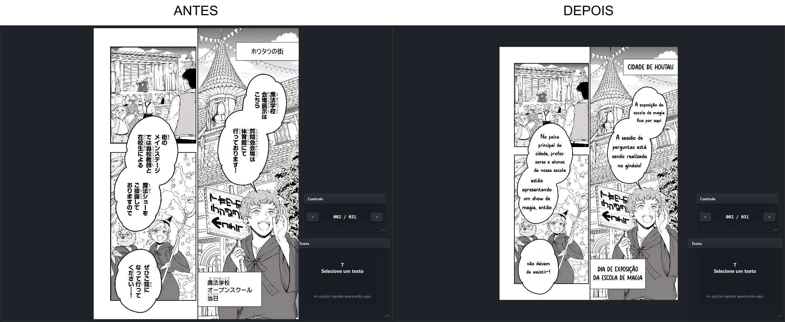

# Fluxo Principal de Typesetting

Este é o fluxo recomendado para preparar uma página.

## 1. Criar ou Abrir Projeto

1. Abra o MangaTypesetter.
2. Crie um projeto novo ou abra um projeto existente.
3. Confirme se as imagens estão em `original/`.

## 2. Criar TextLayers

Você pode criar TextLayers de duas formas:

* manualmente com a ferramenta Texto;
* automaticamente via detecção de balões/texto.

## 3. Rodar OCR

Opções:

* OCR no texto selecionado;
* OCR em todos os textos da página;
* OCR em todas as páginas.

Confira o resultado no campo `Original/OCR`.

## 4. Traduzir e Revisar

Use o campo `Texto traduzido` ou ferramentas de tradução.

Antes de aplicar, revise:

* nomes próprios;
* quebras de linha;
* pontuação;
* onomatopeias;
* termos do glossário.

## 5. Aplicar Texto

Edite `Texto aplicado`.

O canvas deve atualizar em tempo real com preview leve.

Após pequena pausa, o render final com stroke/cache é atualizado.

## 6. Gerar Máscara

Para remover o texto original:

1. selecione a TextLayer;
2. gere máscara;
3. confira se a área branca cobre o texto;
4. ajuste se necessário.

## 7. Gerar Repintura

Depois da máscara:

1. envie imagem + máscara para inpainting;
2. confira o resultado;
3. regenere se necessário.

## 8. Ajustar Estilo

Ajuste:

* fonte;
* tamanho;
* alinhamento;
* contorno;
* margens;
* posição;
* ordem de leitura.

## 9. Exportar

Use:

* `Exportar Página` para teste rápido;
* `Exportar Capítulo` para resultado final.

Os arquivos são salvos em `export/`.

