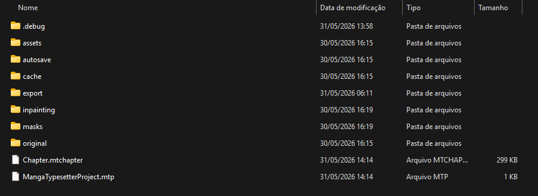

# Projetos e Arquivos

O MangaTypesetter trabalha com uma pasta de projeto. Dentro dela ficam os arquivos do projeto, imagens originais, assets gerados, exportações, cache e dados auxiliares.



## Estrutura Padrão

```text
MeuProjeto/
├─ MangaTypesetterProject.mtp
├─ Chapter.mtchapter
├─ original/
├─ export/
├─ assets/
├─ autosave/
├─ masks/
├─ inpainting/
├─ cache/
└─ .debug/
```

## Arquivos Principais

### `MangaTypesetterProject.mtp`

Guarda metadados do projeto:

* nome;
* template;
* idioma de origem;
* idioma de destino;
* modo de visualização;
* referência para o capítulo.

### `Chapter.mtchapter`

Guarda os dados editáveis do capítulo:

* páginas;
* layers;
* posições;
* estilos;
* vínculos entre texto, máscara e repintura;
* grupos e informações cross-page;
* última página aberta.

## Pastas

### `original/`

Contém as imagens originais importadas.

Não edite manualmente esses arquivos enquanto o app estiver aberto.

### `export/`

Destino automático da exportação.

Exportar página ou capítulo salva arquivos nessa pasta sem perguntar destino.

### `assets/`

Pasta auxiliar para arquivos gerados ou copiados pelo app.

### `autosave/`

Usada para salvamentos automáticos e recuperação.

### `masks/`

Guarda arquivos de máscara criados pelo OpenCV Server ou por operações de seleção.

### `inpainting/`

Guarda imagens finais de repintura/inpainting.

### `cache/`

Guarda dados temporários que podem ser recriados.

### `.debug/`

Existe apenas para inspeção em Debug.

Subpastas usadas:

* `.debug/ocr`: crops enviados ao OCR.
* `.debug/inpaint`: imagem, máscara, prompt e payload enviados para inpainting/ComfyUI.

## Boas Práticas

* Mantenha cada capítulo em uma pasta separada.
* Evite renomear arquivos gerados manualmente.
* Faça backup da pasta inteira do projeto.
* Para enviar um projeto para debug, inclua `.mtp`, `.mtchapter`, `original/`, `masks/` e `inpainting/`.

