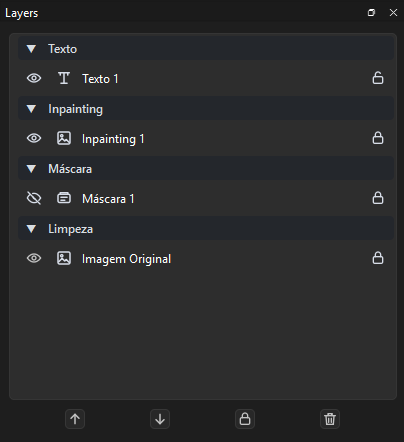
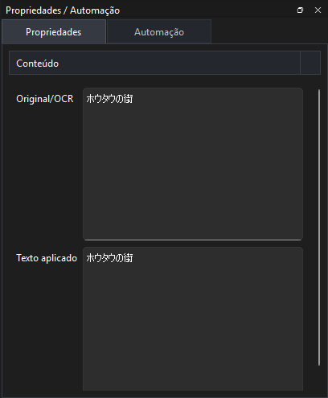

# Layers e Propriedades

Layers são os elementos editáveis de uma página.



## Tipos de Layer

### ImageLayer

Representa a imagem base da página.

Normalmente não é editada diretamente.

### TextLayer

Caixa de texto usada para OCR, tradução e texto final aplicado.

Campos principais:

* `Original/OCR`: texto extraído da imagem.
* `Texto traduzido`: tradução revisada ou importada.
* `Texto aplicado`: texto renderizado no canvas.

Propriedades visuais:

* fonte;
* tamanho;
* negrito;
* itálico;
* cor;
* alinhamento;
* opacidade;
* margens;
* strokes/contornos.

### CleanupLayer

Área retangular de limpeza manual.

### MaskLayer

Máscara binária usada para indicar a área que deve ser removida/repintada.

Por padrão, máscaras podem ficar ocultas para não atrapalhar a edição.

### InpaintLayer

Resultado visual da repintura.

Cada `InpaintLayer` deve ser individual por página, mesmo quando o processamento usa crop contínuo internamente.

## Relações Entre Layers

Fluxo comum:

```text
TextLayer
├─ MaskLayer
└─ InpaintLayer
```

A `TextLayer` é o elemento raiz. A máscara e a repintura ficam vinculadas a ela.

## Seleção de Layer

Ao clicar em uma layer:

1. o item visual é selecionado;
2. o painel Layers seleciona a linha correspondente;
3. o painel Propriedades mostra os campos da layer;
4. ações contextuais passam a usar essa layer.

## Remoção em Cascata

Ao remover uma `TextLayer`, o app também deve remover dependentes relacionados:

* máscaras vinculadas;
* inpaints vinculados;
* vínculos cross-page quando existirem.

Isso evita layers órfãs no projeto.

## Propriedades

O painel `Propriedades` muda conforme a layer selecionada.

### TextLayer

Use para editar conteúdo e aparência do texto.



### MaskLayer

Use para conferir path, preview e ações de edição/regeneração.

### InpaintLayer

Use para conferir imagem final, path e vínculos.

