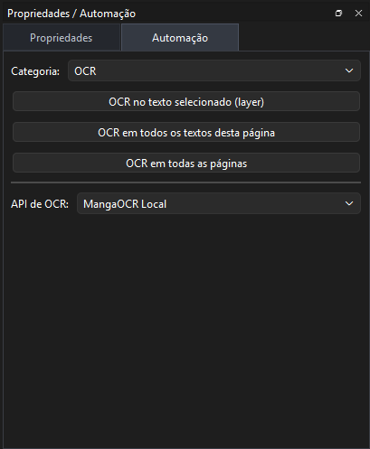

# OCR e Automação

OCR extrai texto visível de uma área ou `TextLayer`.



## Aba Automação

A aba `Automação` contém a categoria `OCR`.

Botões disponíveis:

* `OCR no texto selecionado (layer)`;
* `OCR em todos os textos desta página`;
* `OCR em todas as páginas`.

Abaixo dos botões há o seletor da API OCR.

## OCR no Texto Selecionado

Use quando quiser rodar OCR em apenas uma `TextLayer`.

Requisitos:

* projeto aberto;
* `TextLayer` selecionada;
* API OCR configurada e selecionada.

Resultado:

* o campo `Original/OCR` da TextLayer é preenchido;
* o canvas e propriedades são atualizados sem reconstruir toda a página.

## OCR em Todos os Textos da Página

Executa OCR em todas as `TextLayer`s da página ativa.

No modo Contínuo:

* usa a página ativa;
* `CrossPageTextLayer` que toca a página deve entrar uma única vez.

## OCR em Todas as Páginas

Percorre o projeto inteiro e coleta todas as `TextLayer`s.

Comportamento esperado:

* não troca visualmente de página a cada OCR;
* não reconstrói o painel de layers a cada layer;
* continua processando mesmo se uma layer falhar;
* atualiza a UI no final ou de forma leve.

## APIs OCR

APIs comuns:

* MangaOCR Local;
* PaddleOCR Local;
* LM Studio OCR;
* ChatGPT OCR;
* Gemini OCR.

O seletor da aba Automação usa APIs configuradas na categoria OCR.

## Debug de OCR

Em build Debug, os crops enviados para OCR são salvos em:

```text
<projectDir>/.debug/ocr/
```

Use essa pasta para conferir se a imagem enviada ao OCR está correta.

## OCR Depende de Máscara?

Não necessariamente.

OCR normalmente usa o crop da imagem original dentro da área da `TextLayer`.

Máscara pode fazer parte de outros fluxos, como remover texto e repintar fundo, mas OCR não deve depender de uma `MaskLayer` para funcionar.

## Pré-processamento

Em Configurações de OCR pode existir opção para isolar região clara do balão.

Use com cuidado:

* útil para balões brancos;
* pode cortar texto em fundo colorido;
* deve ficar desligado quando o texto está sobre cenário, efeito ou fundo escuro/colorido.

