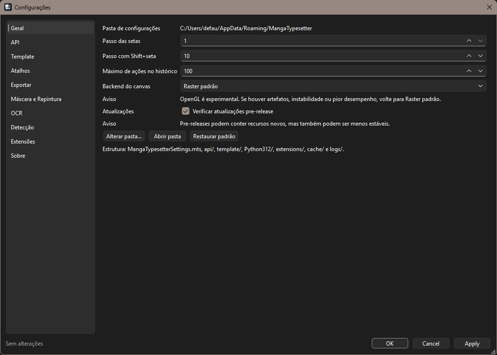
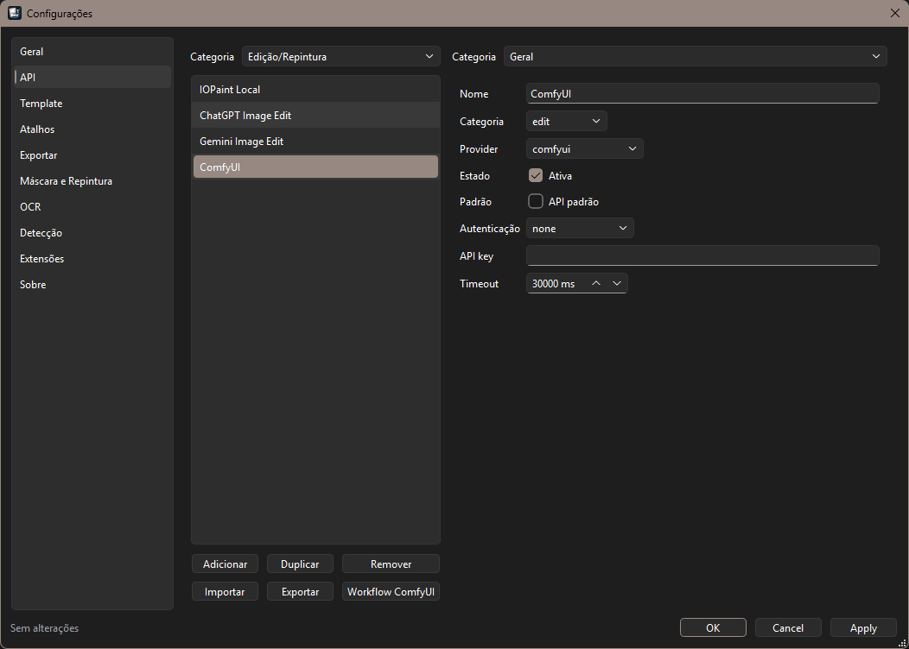

# Configurações

A janela de Configurações organiza preferências gerais, APIs, templates, atalhos, exportação, OCR, detecção e extensões.

## Geral

Inclui opções gerais do app, como backend do canvas e atualização.

### Backend do Canvas

Opções:

* `Raster padrão`;
* `OpenGL (experimental)`.

Se houver artefatos ou instabilidade, use Raster.

## API

Gerencia APIs de:

* tradução;
* OCR;
* edição/inpainting;
* provedores customizados.

Também permite importar workflow ComfyUI.

## Template

Define padrões usados ao criar projeto ou TextLayer:

* estilo de texto;
* idioma;
* modo de visualização;
* APIs padrão.

## Atalhos

Permite configurar atalhos de ferramentas e comandos.

Observação:

* `Espaço` é tratado como pan temporário, não como atalho persistente da ferramenta Pan.

## Exportar

Controla formato e comportamento da exportação.

Veja também: [Exportação](08-exportacao.md).

## Máscara e Repintura

Configura servidores e opções de máscara/inpainting:

* IOPaint;
* OpenCV Mask;
* safety margin;
* estratégia de inpainting;
* APIs de edição.

## OCR

Configura:

* MangaOCR Server;
* PaddleOCR Server;
* crop padding;
* isolamento de região clara;
* APIs OCR.

## Detecção

Configura detector de balões/texto.

Servidor local comum:

* Comic Speech Bubble Server.

## Extensões

Mostra servidores locais e pacotes Python.

Ações esperadas:

* iniciar/parar servidor;
* testar `/health`;
* restaurar arquivos;
* abrir pasta;
* configurar servidor.

Configurar OpenCV Server deve abrir `Máscara e Repintura`.

Configurar PaddleOCR Server deve abrir o diálogo de configuração do PaddleOCR.

